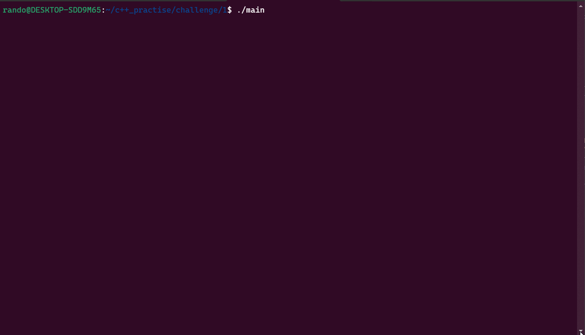
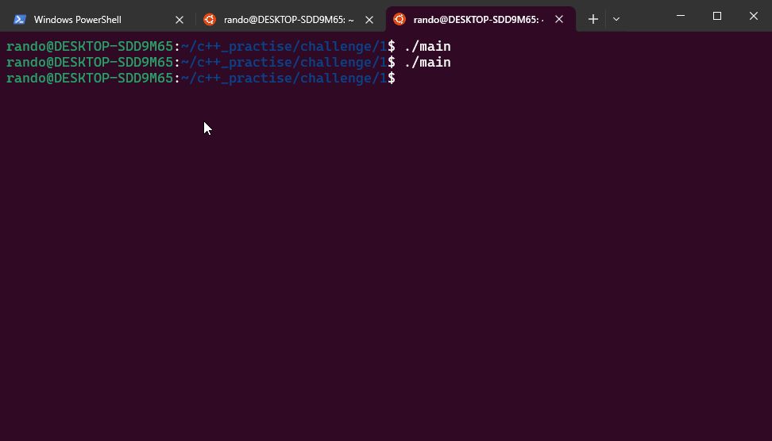

# How to run
Install ncurses (library to develop text-based user interfaces) 
```
sudo apt update
sudo apt install libncurses5-dev libncursesw5-dev
```
Verify that they are installed 
```
ls /usr/include/ncurses.h
ls /usr/include/ncursesw/ncurses.h
```

Compile `g++ main.cpp -o main -lncurses` and then run `./main` to start the program. You navigate either by arrow key up and down or by invoking the commands listed. If you invoke other commands not listed nothing should happen.

# Description
I did some extra work aside from implementing the program. These things were:

* Implemented my own vector from scratch, although not all functions from std::vector is supported for obvious reasons, because it would take too long to implement them not to mention testing them, could easily reach up to 2k-3k lines of code. Don't have time for that.
* Implemented my own simple iterator. This is just a wrapper around a pointer. I think this was mostly because for each loop required iterators or something, so that's why I opted for this.
* Used [ncurses](https://invisible-island.net/ncurses/announce.html) to implement an interactive TUI (text-based user interface) for the program. So user can both utilize the key arrows or the commands to interact with the program. ncurses is a low-level library for coding TUIs based on C. Since it's lower level you have more opportunities to shoot yourself in the shoot while working with it, but more control. The popular one for c++ seems to be [FTXUI](https://github.com/ArthurSonzogni/FTXUI), and is used for more advancecd TUI.
* I ignored the requirement of checking for duplicates, could easily add that check to add_numbers method, but I feel like vectors in general can have duplicates, I guess the duplicate check is just for exercise sake. 
* A file is produced after quitting the program that logs the relevant statistics as required by the challenge.

# TODO
I don't have time so I won't be doing these for a while

* Implement insert to my custom vector
* Add proper tests to catch2 testing suite
* Debug my custom vector more to find edge cases or potential trivial errors I might have missed
* The current TUI program only works for double, but could generalize it to any numeric types
* In the future if need to add more commands should abstract the program to be easily extensible, by refactoring commands to classes perhaps etc.

# My thoughts
By far the hardest part was implementing the vector from scratch, particularly the modifier methods, where I had to deal with dynamic memory management. Still overall very basic dynamic memory management as it's only a vector, so nothing too complex going on. Because of the nature of implementing these data structures the boilerplate makes it look like alot of code, but it's really not that much once you squint your eyes and examine what's going on. The only methods that were a bit complicated only in relation to the other methods (wasn't complicated in a general sense) was the resize method. But since I didn't implement all the methods that std::vector supports, there may have been more difficult methods that I don't know of. When it comes to testing I didn't use [catch2](https://github.com/catchorg/Catch2) this time, instead I went with just a sloppy informal way of testing in a .cpp file. Maybe when I got more time will I move the tests to a proper testing suite, but not right now unfortunately.

Lastly, the TUI addition to the challenge was pretty cool and something I found when googling, I like the simple user interface and interaction.

# Screenshots

